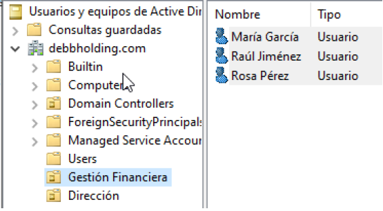

# Informe Técnico: Gestión de Acceso y Seguridad en Windows Server

## Índice
- [Introducción](#introducción)  
- [Caso Práctico 1: Creación del dominio Active Directory](#caso-práctico-1-creación-del-dominio-active-directory)  
- [Caso Práctico 2: Despliegue de software y permisos con GPO](#caso-práctico-2-despliegue-de-software-y-permisos-con-gpo)  
- [Preguntas Teóricas](#preguntas-teóricas)

---

## Introducción

En este informe se detalla paso a paso la resolución de los dos casos prácticos relacionados con la gestión segura del acceso en un entorno Windows Server. Se explica cómo configurar un controlador de dominio Active Directory, organizar unidades y usuarios, y aplicar directivas de grupo (GPO) para automatizar tareas de administración y reforzar la seguridad. Cada sección incluye objetivos, configuraciones a realizar y los resultados esperados. El estilo es técnico y estructurado para facilitar su comprensión y replicación.

---

## Caso Práctico 1: Creación del dominio Active Directory

### 1. Preparar el servidor (nombre y zona horaria)

Asignar nombre significativo al servidor (ej. `SRV-DC01`), ajustar la zona horaria y reiniciar.

---

### 2. Instalar el rol de Servicios de Dominio de Active Directory (AD DS)

Desde el Administrador del Servidor se inicia el asistente para agregar roles y características:

Se seleccionan las características requeridas para Servicios de dominio de Active Directory:

Se selecciona el rol de Servicios de dominio de Active Directory:

Se confirman las selecciones antes de la instalación:

Se procede a hacer clic en instalar para iniciar el proceso:

---

### 3. Promover el servidor a controlador de dominio

### 3. Promover a controlador de dominio

Se inicia la promoción del servidor a controlador de dominio desde el Administrador del Servidor:

Se configura la implementación como un nuevo bosque con el nombre de dominio `midominioholding.com`:

Se definen las opciones del controlador de dominio, incluyendo la contraseña DSRM:

Se revisan y confirman todas las opciones antes de la instalación:

---

### 4. Configurar cliente y unir al dominio

Se configura la propiedad de red del servidor para asignar una IP fija y el DNS apuntando al servidor:

Resultado tras la configuración de IP y DNS:

Se verifica la creación de las Unidades Organizativas (OU) en Usuarios y Equipos de Active Directory, ejemplo OU “Gestión financiera”:

Se crea también la OU “Dirección”:

---

### 5. Crear usuarios y asignar permisos

Se definen permisos en carpetas compartidas para la GPO “Presets”:

Se crea el usuario "Rosa Pérez" con su correo electrónico asociado:

---

### 6. Despliegue de software y permisos con GPO

Se prepara el instalador de Google Chrome (archivo `.msi`) en la carpeta compartida “Presets”:

La carpeta está compartida y accesible en red:

Desde la consola de administración de directivas de grupo (GPMC) se crea y vincula la GPO “Presets” en el dominio:

En el editor de administración de directivas de grupo se configura la instalación del software Google Chrome usando la ruta UNC al `.msi`:

Se aplica la política a la OU “Gestión financiera” con filtrado de seguridad adecuado:

Se crea la carpeta “Documentación Confidencial” y se comparte para usuarios del grupo Dirección:

---

### 7. Configuración de permisos y accesos

Se configuran los permisos NTFS y de compartición para la carpeta “Documentación Confidencial”:

Desde la consola de administración de directivas de grupo, se crea y vincula la GPO “Documentación Confidencial” en la OU Dirección:

En el editor de administración de directivas de grupo se crea un acceso directo en el escritorio del usuario con destino a la carpeta compartida:

Resultado tras aplicar la política y comprobar el acceso directo en el escritorio:

Se prueba el acceso intentando abrir la carpeta desde un grupo sin permisos, lo que es denegado correctamente:

---

### 8. Política de expiración de contraseñas

Desde la consola de dominios se configura la política de expiración de contraseñas con un límite de 7 días:

---

## Preguntas Teóricas

### a) ¿Cómo se modifican los permisos de un usuario en una carpeta compartida?

Mediante las propiedades de la carpeta:

- **Pestaña Compartir:** Configura permisos de red (compartición).
- **Pestaña Seguridad:** Configura permisos NTFS (nivel de sistema de archivos).
- Puede utilizarse también la línea de comandos (`icacls`) o políticas de grupo.

### b) ¿En qué se diferencia el acceso local del acceso remoto en un entorno Windows Server?

- **Acceso local:** Se realiza directamente desde el servidor físico (teclado/monitor).
- **Acceso remoto:** Se realiza mediante red, generalmente usando RDP.
- El acceso remoto requiere habilitación previa y permisos asignados.

### c) ¿Qué función tiene la consola de "Administración de directivas de grupo" (GPMC) en la gestión de permisos?

Permite:

- Crear, editar y aplicar GPOs a usuarios y equipos.
- Establecer configuraciones de seguridad, software, red, accesos, etc.
- Centralizar la administración de políticas del dominio.

### d) ¿Qué diferencia hay entre un usuario estándar y un usuario con privilegios de administrador?

- **Usuario estándar:** Permisos limitados, no puede instalar software ni modificar configuraciones del sistema.
- **Administrador:** Permisos elevados, acceso total al sistema, puede modificar políticas, usuarios, software y recursos.

---

**Fin del informe técnico.**
